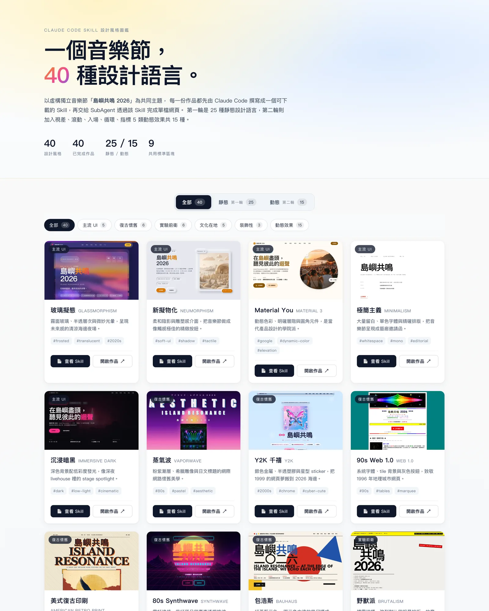

# Claude Code Skill 設計風格圖鑑 · 島嶼共鳴 2026

> 一個音樂節 + 一個 App，**52 種設計語言**。
> 由 Claude Code 主執行緒撰寫 Skill，再交給 SubAgent 透過 Skill 完成單檔網頁。
> 內容相同、視覺各異——這就是設計風格的本體。

🌐 **線上瀏覽**：[www.casper.tw/claude-skill-design-gallery](https://www.casper.tw/claude-skill-design-gallery/)



---

## 這是什麼

52 份單檔 HTML 網頁，分三輪。前兩輪是同一個虛構音樂節「**島嶼共鳴 2026**」（12 樂團 / 3 舞台 / 3 票價 / 9 贊助商 / 9 個標準區塊）；第三輪則換成同一個虛構音樂串流 App「**迴聲 Resona**」（6 功能 / 3 訂閱方案 / 8 個標準畫面）。同一份內容，用 52 種**完全不同的設計語言**重新詮釋。

- 🎨 **第一輪 · 25 種靜態風格**：玻璃擬態、新擬物化、Material You、極簡、暗黑、蒸氣波、Y2K、Web 1.0、美式復古印刷、Synthwave、包浩斯、野獸派、故障藝術、賽博龐克、構成主義、ASCII 終端機、雜誌排版、日式禪意、中國風國潮、北歐極簡、瑞士國際、台灣廟會、等距 3D、手繪塗鴉、漸層 Mesh
- 🎬 **第二輪 · 15 種動態效果**：視差滾動 × 3、Scroll-driven × 3、入場動畫 × 3、循環動畫 × 3、指標互動 × 3
- 📱 **第三輪 · 12 種行動 App 介面**：iOS HIG、iOS 深色、Material You、One UI、Fluent、鴻蒙、iOS6 擬物、Android Holo（8 原生平台）＋ 新野獸派、玻璃擬態、Y2K、線框 lo-fi（4 風格化）。在圖鑑中以**手機外框 + 即時 iframe** 呈現直式 App 畫面。

每份 Skill 都是**可下載的單一目錄** `.claude/skills/<slug>/`——複製到任意 Claude Code 專案即可被 Claude 召喚並重現該風格網頁。


---

## 工作流

```
┌────────────────────────────────────────────────────────────┐
│  主執行緒 (Claude Code)                                    │
│                                                            │
│  1. 寫 .claude/skills/<slug>/SKILL.md                     │
│     ↓                                                      │
│  2. scripts/gen-images.mjs → codex imagegen 批次產圖      │
│     ↓                                                      │
│  3. Agent(style-page-builder) 派 SubAgent                 │
│     讀 SKILL.md + festival-brief.md                       │
│     → public/works/<slug>/index.html  (≤ 200 KB)          │
│     ↓                                                      │
│  4. scripts/verify-page.mjs 驗 9 區塊 / 12 樂團 / 票價 ... │
│     scripts/screenshot-pages.mjs 截縮圖                   │
│     scripts/record-webm.mjs 錄 3s 動態 webm (round 2)     │
│     ↓                                                      │
│  5. 更新 src/data/works.ts 標 shipped                     │
│     Vue gallery 自動列出新卡                              │
└────────────────────────────────────────────────────────────┘
```

關鍵原則：**先寫 Skill 再呼叫 SubAgent**。Skill 的「可用性」是被 SubAgent 透過它穩定產出網頁的能力來驗證的。

---

## 啟動

```bash
npm install
npm run dev
```

開啟 http://localhost:5173 即可瀏覽圖鑑。

### 常用指令

| 指令 | 用途 |
| --- | --- |
| `npm run dev` | 啟動 Vite 開發伺服器 |
| `npm run build` | 產 production build |
| `npm run preview` | 預覽 build 結果（含 base path） |
| `npm run deploy` | build + 推到 gh-pages 分支（手動部署備案） |
| `node scripts/verify-page.mjs --all` | 驗證全部頁面（festival 9 區塊／樂團／票價、app 8 畫面／App 內容、無 CDN、motion 檢查） |
| `node scripts/screenshot-pages.mjs --slug <slug>` | 截單張縮圖 |
| `node scripts/record-webm.mjs --slug motion-<slug>` | 錄 3s WebM hover 預覽 |
| `node scripts/gen-images.mjs --slug <slug>` | 透過 codex imagegen 批次產圖 |
| `node scripts/cover-shot.mjs` | 為 README 拍封面 |

---

## 部署到 GitHub Pages

**儲存庫名稱**：`claude-skill-design-gallery`（若改名，調整 `vite.config.ts` 的 `PROD_BASE` 或設環境變數 `VITE_BASE=/your-repo/`）

### 自動部署（推薦）

`.github/workflows/deploy.yml` 已配置——push 到 `main` 即觸發：

1. GitHub repo → Settings → Pages → Source 選 **GitHub Actions**
2. push 一次，等 Actions 跑完
3. URL：`https://<username>.github.io/<repo>/` 或自訂 domain

Action 會自動把 `VITE_BASE` 設成 `/<repository.name>/`，免改檔。

### 手動部署

```bash
npm run deploy
```

build 後把 `dist/` 推到 `gh-pages` 分支。在 Pages → Source 選 `gh-pages`。

---

## 分析與廣告（選用）

本站支援 **GA4** 與 **Google AdSense**，全部由環境變數控制——**未設定就完全不載入、不送任何請求**（build 產物也不含任何 Google loader URL）。

| 變數 | 用途 |
| --- | --- |
| `VITE_GA_ID` | GA4 評估 ID（`G-XXXXXXXXXX`） |
| `VITE_ADSENSE_CLIENT` | AdSense 發布商 ID（`ca-pub-…`） |
| `VITE_ADSENSE_SLOT_INFEED` | 作品 grid 內每 8 張卡插入的 in-feed 版位 |
| `VITE_ADSENSE_SLOT_SIDEBAR` | footer 版位（可選） |

- **本機**：`cp .env.example .env.local` 後填值（未填的功能不啟用，且不顯示任何版位/佔位）。
- **部署**：在 repo **Settings → Secrets and variables → Actions → Variables** 設同名 `vars`（這些 ID 本就公開，用 Variables 而非 Secrets）。
- **邊界**：GA / AdSense 只存在於外層 gallery，作品頁 `public/works/*/index.html` 維持單檔自足、無外部 CDN。
- ⚠️ 正式投放 AdSense 前，需自行補上隱私權政策頁與 cookie 同意機制（本專案僅接好線路與預留版位）。

---

## 下載任一 Skill 給自己用

兩種方式：

1. **線上 drawer 一鍵複製**：在 [圖鑑](https://www.casper.tw/claude-skill-design-gallery/) 任一張卡點「📄 查看 Skill」，drawer 滑出 SKILL.md 全文，按右上「複製 SKILL.md」。
2. **複製整個目錄**：把 `.claude/skills/design-<slug>/` 或 `.claude/skills/motion-<slug>/` 整個 copy 到你自己專案的 `.claude/skills/` 即可被 Claude 召喚。

每個 Skill 包含：
- `SKILL.md` — 風格哲學 / design token / typography / layout / do-don't / reference snippets
- `assets-manifest.json` — AI 圖像生成 prompt 清單（給 codex imagegen 用）
- （可選）`references/snippets.md` — 補充材料

---

## 標準 9 區塊（festival）

前兩輪 40 份音樂節頁都用同一份 HTML 結構骨架，每個區塊用 `<section data-block="<id>">` 包起來：

| # | data-block | 內容 |
|---|---|---|
| 1 | `hero` | 節慶名、slogan、日期、地點、CTA |
| 2 | `about` | 理念、4 個關鍵數字 |
| 3 | `lineup` | 12 組樂團（3 組頭條） |
| 4 | `schedule` | 三日 × 三舞台時程表 |
| 5 | `venues` | 共鳴山 / 海風 / 部落三舞台 |
| 6 | `tickets` | 單日 / 三日 / VIP 三種票價 |
| 7 | `travel` | 自行開車 / 大眾運輸 / 住宿建議 |
| 8 | `sponsors` | Title / Gold / Silver 贊助商 |
| 9 | `footer-faq` | 7 條 FAQ + 聯絡 |

差異**只在視覺設計**，便於並列比較不同風格的詮釋。

第三輪 12 份行動 App 頁則改用 8 個 `<section data-screen="<id>">`（`status-bar → home → search → detail → player → library → profile → tab-bar`），內容換成「迴聲 Resona」App，並要求 `<body data-viewport="mobile">` 與 390×844 直式版面。

---

## 動態風格的硬性規範

第二輪 15 個 motion-* 風格除了通用契約外，**必須**：

1. 純 vanilla JS / CSS / IntersectionObserver，**禁用** GSAP / Lottie / 任何外部動畫庫
2. 必含 `@media (prefers-reduced-motion: reduce)` 區塊
3. scroll listener 必須 `passive: true`、配合 `requestAnimationFrame` 節流
4. 動畫只能動 `transform` + `opacity`（禁止 `top/left/width/height` 觸發 reflow）
5. JS 失敗或 reduced motion 模式下，內容仍須完整可讀
6. `<body data-motion-type="parallax|scroll-driven|reveal|loop|pointer">` 必須存在
7. inline `<script>` ≤ 8 KB
8. 單檔總大小仍 ≤ 200 KB

完整契約見 [`.claude/agents/style-page-builder.md`](./.claude/agents/style-page-builder.md)。

---

## 技術棧

- **Vue 3.5** + **Vite 8** + **TypeScript**
- **Cheerio** — HTML 解析驗證
- **Sharp** — 圖像處理
- **Playwright + ffmpeg** — 自動截圖 / 錄 WebM
- **codex CLI** — 透過內建 `imagegen` 工具產 AI 圖

---

## License

所有樂團名、贊助商名、節慶名皆為虛構，與任何實際存在的組織無關。
作品本身與 Skill 內容可自由使用、修改、二創。
